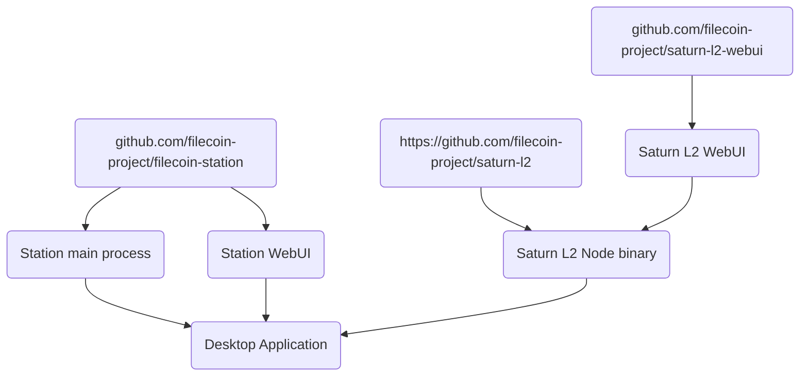

# Developer Guide

## Architecture Overview

### Code organization

Repositories:

- https://github.com/filecoin-project/filecoin-station
- https://github.com/filecoin-project/saturn-l2
- https://github.com/filecoin-project/saturn-l2-webui

### End-to-end release workflow

1. `saturn-l2-webui` publishes a new release with WebUI assets
2. `saturn-l2` is updated to use the new `saturn-l2-webui` version
3. `saturn-l2` publishes a new release
4. `filecoin-station` is updated to use the new `saturn-l2 `version
5. `filecoin-station` publishes a new release

## Development workflow

### Initial setup

1. Install the latest LTS version of Node.js
2. Clone this repository
3. Run `npm install` to install all dependencies
4. Run `npm run build:saturn` to download Saturn L2 Node.

### Making changes

- Run `npm start` to open the Electron app and load the WebUI via the Vite DEV server. Changes made
  inside `renderer` files will be immediately applied in the running app.

- Run `npm run lint` to check for coding style issues and type errors. Run `npm run lint:fix` to fix
  formatting issues.

- Run `npm test` to run all automated tests (unit/integration/end-to-end).

### Building the app package

Run `npm run package` to create the app package for your local platform. Check the `dist` directory
for app artefacts, for example a DMG installer for macOS.

## CommonJS vs ES Modules

Electron does not support ESM for the backend code. We use CommonJS (`require`) in those files.

The front-end is written in TypeScript; there is no such limitation. Therefore inside `renderer`, we
use ESM to get better developer experience and tooling support.

## Updating to a new major version of Electron/Chromium

After updating to a newer Chromium version, update the compilation target for `renderer` files in
[vite.config.js](./../vite.config.js).
